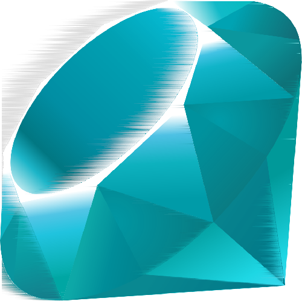

# Katela OS

> [!IMPORTANT]
**Katela is not a so-called 'toy OS'.**   
**You can call this project a hobby, entertainment, or even a real OS.** 
**But Katela, with every commit, proves that it is not a toy and not a project that will shut down at the first sign of trouble — I guarantee that.**

Katela is an operating system written from scratch. It currently provides basic filesystem and more. The project is focused on building a clear and understandable system from the ground up, with plans to gradually expand its capabilities over time. I will be glad if you give feedback or make 'distributions'. I will always be happy to see your creativity and skill

> **Tip:** Check Github wiki to see more information!

Initially, Katela was nothing more than a learning project, but now its scale is growing at an incredibly fast pace. Join the Katelians community. More information about pull requests can be found in CONTRIBUTING.md. Also, write your ideas, problems, and the like in discussions or in issues

Cancelled - Nope (In the next file update, the slot will be deleted)

Freezed - Maybe

Planned - When have free time

Coming soon - Yes

Working on - YEEES

|Roadmap|Status|
|--------|-------|
|More GRUB Settings|Freezed|
|Website|Planned|

Please do not claim derivative works as "from scratch" if they are based on this project.
